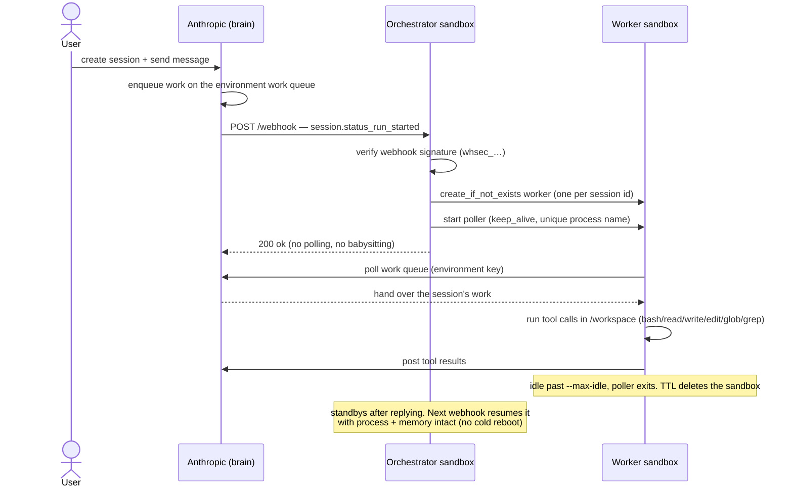

# Run Claude Managed Agent tools with Blaxel Sandboxes

Claude Managed Agents (CMA) lets Anthropic run the agent loop (the model, tool-calling, skills, and memory) while **tool execution happens on infrastructure you control**. When Claude decides to run a tool, something on your side has to execute it and post the result back. This guide shows how to make that "something" a **Blaxel sandbox**: a secure microVM that scales to zero when idle and resumes in milliseconds.

This is the **self-hosted / advanced reference** path for teams that want to own the webhook control plane themselves.

## Architecture

Anthropic hosts the brain; Blaxel provides the hands. Two roles, both Blaxel sandboxes:

```
Anthropic (orchestration)
   │  session.status_run_started  (webhook)
   ▼
Orchestrator sandbox  -- FastAPI on a public preview URL (the webhook target)
   │  spawns one worker per session, returns 200 (no polling, no babysitting)
   ▼
Worker sandbox  -- `ant beta:worker poll`
   • self-claims the session from the environment's work queue
   • downloads skills, runs tool calls (bash/read/write/edit/glob/grep) in /workspace
   • posts results back to Anthropic
   • exits when idle; a TTL auto-deletes the sandbox
```

The full lifecycle of one session:



- **Orchestrator:** a Blaxel sandbox running a small webhook server, exposed on a public **preview URL** that you register as the Anthropic webhook. An inbound webhook resumes the sandbox from standby (process and memory survive resume), so it costs nothing while idle and has no execution-time limit. It does one thing per event: spawn a worker and return.
- **Worker:** a Blaxel sandbox that runs Anthropic's `ant` worker in `poll` mode. It claims the queued session itself, executes the tool calls, posts results, and shuts down. It is launched with **process keep-alive** so the sandbox stays active for the whole session instead of standbying after ~15s of no inbound connection (the poller only makes outbound calls). A TTL cleans it up once the poller exits, so nothing has to supervise it.

This is the standard control-plane plus per-session compute-plane split, with no changes to the Blaxel platform, just sandboxes.

## Prerequisites

- A Blaxel workspace, the `bl` CLI, and a **service-account API key** (`BL_API_KEY`). Create one under Service Accounts. The orchestrator needs it to spawn worker sandboxes.
- Access to Claude Managed Agents (the `managed-agents-2026-04-01` beta).
- Two Anthropic credentials, used in different places:
  - **`ANTHROPIC_API_KEY`:** your standard API key, for the control-plane calls in steps 1, 3, and 5 (create environment, agent, session).
  - **`ANTHROPIC_ENVIRONMENT_KEY`** (`sk-ant-oat01-…`): generated per environment in step 1; this is what the worker uses to authenticate to the work queue.
- The `ant` CLI is baked into the worker image (step 2), so there is nothing to install locally.
- **Docker** (for `bl push` and the worker smoke test).

## Preflight: verify your API key has CMA beta access

A 200 response with an array body means the key is valid and in the right org. A 401 means the key is invalid or lacks CMA beta access; a wrong org will return an empty list instead of your resources.

```bash
curl -sS -o /dev/null -w "HTTP %{http_code}\n" \
  https://api.anthropic.com/v1/environments \
  -H "x-api-key: $ANTHROPIC_API_KEY" \
  -H "anthropic-version: 2023-06-01" \
  -H "anthropic-beta: managed-agents-2026-04-01"
```

## 1. Create the self-hosted environment

```bash
export ANTHROPIC_ENVIRONMENT_ID=$(curl -sS https://api.anthropic.com/v1/environments \
  -H "x-api-key: $ANTHROPIC_API_KEY" \
  -H "anthropic-version: 2023-06-01" \
  -H "anthropic-beta: managed-agents-2026-04-01" \
  -H "content-type: application/json" \
  -d '{"name": "blaxel-selfhosted", "config": {"type": "self_hosted"}}' \
  | python3 -c "import sys,json; d=json.load(sys.stdin); print(d.get('id') or sys.exit(json.dumps(d)))")
echo "environment: $ANTHROPIC_ENVIRONMENT_ID"
```

Then in the Anthropic Console (console.anthropic.com), go to **Manage > Environments**, open the environment by name, and click **Generate environment key**. Export the `sk-ant-oat01-…` key; the orchestrator forwards it to each worker:

```bash
export ANTHROPIC_ENVIRONMENT_KEY=sk-ant-oat01-...
```

## 2. Build the worker image

The worker image (see `worker/Dockerfile`) is built on `node:22-bookworm-slim` -- a glibc base so the agent's `pip` installs get real manylinux wheels (numpy, pandas, and so on) instead of musl source builds. Key decisions: the Blaxel sandbox API binary is copied in at build time; `ant` 1.10.0 is downloaded for the right arch; `python3`, `bash`, `git`, `curl`, `tar`, and `unzip` are installed (bash is required by the agent toolset, unzip and tar by skill downloads); `EXTERNALLY-MANAGED` is removed so the agent can `pip install` freely inside this disposable box; `/workspace` and `/mnt/session/outputs` are created; `HOME` is set to `/workspace`.

The entrypoint (`worker/entrypoint.sh`) starts the sandbox API in the background and waits for it on `:8080` before the sandbox accepts commands. The orchestrator then starts the `ant` poller via the process API after the sandbox is ready.

Push it from inside the worker dir: `bl push --type sandbox`, which publishes `sandbox/cma-worker:latest`.

## 3. Deploy the orchestrator

The orchestrator is a Blaxel sandbox running this webhook server. It verifies the signature, and on `session.status_run_started` spawns a worker and returns immediately:

```python
@app.post("/webhook")
async def webhook(request: Request):
    raw = await request.body()
    try:
        event = client.beta.webhooks.unwrap(raw.decode(), headers=dict(request.headers))
    except Exception:
        return JSONResponse({"error": "invalid signature"}, status_code=401)
    if event.data.type == "session.status_run_started":
        # Await the spawn: holding the inbound webhook connection open keeps the
        # orchestrator sandbox active during the spawn (no standby mid-flight).
        # The full app also serializes starts per session and skips duplicate
        # webhook retries while the previous poller is still alive.
        await _spawn_worker_once(event.data.id)   # event.data.id is the session id
    return {"status": "ok"}

async def _spawn_worker(session_id: str):
    # Blaxel sandbox names allow only lowercase alphanumerics + hyphens.
    # See _worker_name() in orchestrator/app.py for the full sanitization.
    name = _worker_name(session_id)
    worker = await SandboxInstance.create_if_not_exists({
        "name": name, "image": "sandbox/cma-worker:latest",
        "memory": 4096, "ttl": "2h",            # max-age cleanup backstop (m/h/d/w)
        "envs": [{"name": "ANTHROPIC_ENVIRONMENT_ID", "value": ENV_ID},
                 {"name": "ANTHROPIC_ENVIRONMENT_KEY", "value": ENV_KEY}],
    })
    await worker.process.exec({
        "name": f"ant-poll-{uuid4().hex[:8]}",  # unique per restart; records persist
        "command": "ant beta:worker poll --workdir /workspace --max-idle 60s",
        "wait_for_completion": False,
        "keep_alive": True,   # hold the sandbox active for the whole session
        "timeout": 3600,      # safety cap; 0 = until the poller exits naturally
    })
```

The handler `await`s the spawn so the inbound webhook connection stays open while the worker is created and the poller starts; that keeps the orchestrator sandbox active during the spawn instead of standbying mid-flight. Once the worker is polling, it holds *itself* active via `keep_alive`. `session.status_run_started` fires once per turn and may be retried, so the full handler serializes starts per session, skips duplicate starts during the poller's idle window, and uses a fresh process name for each real restart. Later turns reuse the same per-session sandbox (`create_if_not_exists` is idempotent) and restart the poller cleanly after the previous one idles out. See `orchestrator/app.py` for the full handler. Build and bring it up (creates the sandbox, starts uvicorn, exposes a public preview):

```bash
(cd orchestrator && bl push --type sandbox)   # build + push the orchestrator image
python setup.py                               # run from the repo root: creates the sandbox, prints the webhook URL
```

The orchestrator runs with `BL_API_KEY` and `BL_WORKSPACE` in its env so the in-sandbox SDK can spawn workers. Unlike a Blaxel Agent, a sandbox does not inherit a workspace identity, so you provide the service-account key.

## 4. Register the webhook

In the Anthropic Console, go to **Manage > Webhooks** and create an endpoint at the printed preview URL (`https://<id>.preview.bl.run/webhook`), subscribed to `session.status_run_started`. Copy the one-time `whsec_…` signing secret, then re-run setup with it exported so the orchestrator can verify deliveries (until then, deliveries are rejected with 503):

```bash
export ANTHROPIC_WEBHOOK_SIGNING_KEY=whsec_...
python setup.py
```

## 5. Create an agent and run a session

```bash
export ANTHROPIC_AGENT_ID=$(curl -sS https://api.anthropic.com/v1/agents \
  -H "x-api-key: $ANTHROPIC_API_KEY" -H "anthropic-version: 2023-06-01" \
  -H "anthropic-beta: managed-agents-2026-04-01" -H "content-type: application/json" \
  -d '{"name":"Coding Assistant","model":"claude-opus-4-8","system":"You are a coding agent. Your working directory is /workspace. The file tools (write/read/edit/glob/grep) are sandboxed to /workspace; absolute paths like /workspace/hello.txt are REJECTED with \"absolute path not permitted\". Always pass bare relative paths to file tools (\"hello.txt\", not \"/workspace/hello.txt\"). Shell (bash) commands are unrestricted and use /workspace/... paths. Every tool call must produce non-empty output: if a shell command would print nothing (for example output redirected to a file), append a status echo such as && echo ok, because an empty tool result is rejected by the API.","tools":[{"type":"agent_toolset_20260401"}]}' \
  | python3 -c "import sys,json; d=json.load(sys.stdin); print(d.get('id') or sys.exit(json.dumps(d)))")
echo "agent: $ANTHROPIC_AGENT_ID"

python example/run_session.py
```

The environment is selected per session (`environment_id` on session create), not on the agent. `run_session.py` creates a session, sends a message, and watches the transcript: the webhook fires, the orchestrator spawns a worker, the worker runs the tools in the sandbox and posts results back, and the agent completes its turn. Pass `--local-worker` to spawn the worker directly and validate the path before the webhook is wired.

## Gotchas (validated)

- **Standby and keep-alive (the big one).** A Blaxel sandbox standbys ~15s after its last *inbound* connection, snapshotting process and filesystem (and resuming in ms). The worker poller only makes *outbound* calls, so without intervention the worker standbys mid-session and the poll loop freezes. Launch the poller with `keep_alive: True` and a `timeout` cap (or `0` to run until it exits naturally) so the sandbox stays active until the session is done. The orchestrator handles its webhook *synchronously*, so the open inbound connection keeps it active during the spawn; it then standbys and resumes on the next webhook.
- **Webhook verification needs `anthropic[webhooks]`.** The orchestrator calls `client.beta.webhooks.unwrap()`; with plain `anthropic` it raises "install anthropic[webhooks]" and every delivery 401s (the request is fine, the dependency is missing). The extra is pinned in `orchestrator/requirements.txt`.
- **The worker image is the agent's runtime.** Whatever the agent executes (python, node, compilers, CLIs) must be installed in the worker image. The default ships `node` (from the base) and `python3`; extend the worker Dockerfile with the languages and tools your agents need.
- **`bash` needs `/bin/bash`.** The Debian base includes it (Alpine would not); skill download also needs `unzip` and `tar`.
- **Working directory.** The worker runs with `--workdir /workspace` and *without* `--unrestricted-paths`, so file tools stay contained to `/workspace`. Absolute paths like `/workspace/hello.txt` passed to file tools are REJECTED with "absolute path not permitted"; always use bare relative paths (`hello.txt`, not `/workspace/hello.txt`). Shell (bash) commands are unrestricted and use `/workspace/...` paths. `--unrestricted-paths` removes that containment; only add it if your agent genuinely needs to touch paths outside `/workspace`, and understand the exposure first.
- **Sandbox names.** Blaxel sandbox names must be lowercase alphanumerics and hyphens; session ids (`sesn_01Ab…`) contain underscores and mixed case, so sanitize before naming a worker.
- **Orchestrator credential.** A sandbox does not get an auto-injected Blaxel identity (an Agent does), so pass a service-account `BL_API_KEY`.
- **Duplicate webhooks / later turns.** Anthropic can retry `session.status_run_started`, and the same session can get later turns. The orchestrator serializes starts per session, skips duplicate starts for the `ANT_MAX_IDLE` window (override with `ANT_RESTART_COOLDOWN`), and uses a unique poller process name for each real restart so completed process records do not block later turns.
- **Worker `--max-idle`** (default `60s`, override with `ANT_MAX_IDLE`) should be generous enough to span the agent's reasoning between tool calls.
- **Tool output must be non-empty.** A shell command that prints nothing (e.g. `echo A > file`, which redirects stdout) makes the worker post an empty tool result, which the API rejects with `400 … minimum string length is 1` and the session stalls. Have the agent append a status echo (the sample system prompt asks for this), or wrap commands so they always emit something.
- **Retrieving outputs.** Tool writes land in `/workspace`; the agent's final artifacts go to `/mnt/session/outputs`. Nothing is auto-exported — read them back through the sandbox filesystem API (`sandbox.fs.read(...)`) or serve them on a preview URL.
- **Credential scope.** The worker holds `ANTHROPIC_ENVIRONMENT_KEY` in its env, which the agent's own `bash` tool can read. That is acceptable because it is a scoped, revocable per-environment key (it can only act on that environment's sessions) — never put your org `ANTHROPIC_API_KEY` on the worker.
- **Teardown.** The worker self-deletes via its TTL once idle. The orchestrator sandbox and its public preview URL persist until you remove them. Delete the orchestrator when done:

  ```bash
  bl delete sandbox cma-orchestrator-app
  ```

  Or via the Blaxel Console, or with the SDK: `await SandboxInstance.delete("cma-orchestrator-app")`.

- **401 invalid x-api-key:** your `ANTHROPIC_API_KEY` is invalid or lacks Claude Managed Agents beta access. Run the preflight check in the section above.
- **Resources created but not visible in the Anthropic Console:** the key belongs to a different org/workspace than the one you are viewing. Confirm the key's org matches the Console you have open.

## Links

- Anthropic: self-hosted sandboxes, platform.claude.com/docs/en/managed-agents/self-hosted-sandboxes
- Blaxel sandboxes and preview URLs, docs.blaxel.ai
