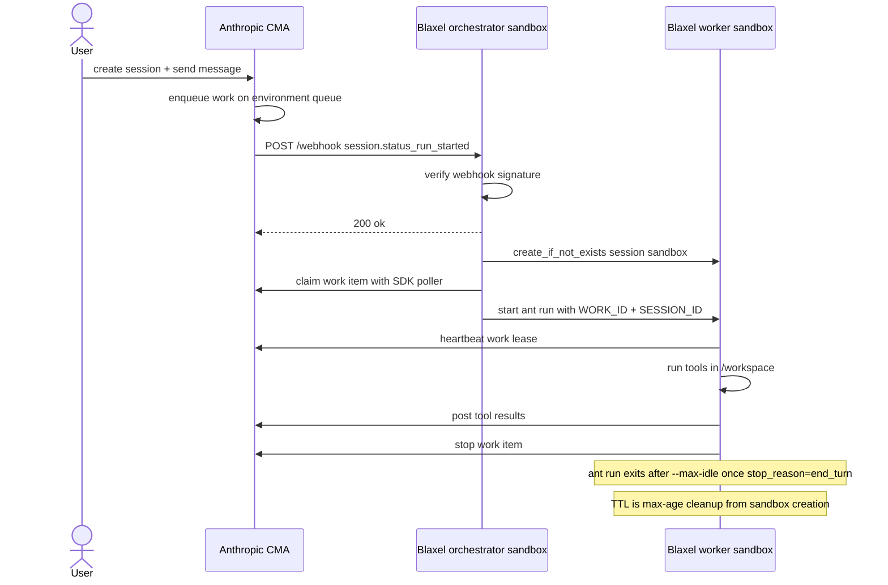

# Run Claude Managed Agent tools with Blaxel Sandboxes

Claude Managed Agents (CMA) gives you an agent loop hosted by Anthropic: the model, session state, event history, configured skills, and tool-calling harness. A self-hosted CMA environment keeps that orchestration on Anthropic's side but moves tool execution into infrastructure you control.

This guide shows the Blaxel version of that self-hosted path: Anthropic runs the agent loop and work queue; Blaxel sandboxes run the webhook dispatcher and the per-session worker runtime.

## What CMA is

CMA separates an agent into three pieces:

| Piece | In this cookbook |
| --- | --- |
| Agent loop | Anthropic runs Claude, session state, event history, configured skills, and tool selection. |
| Environment queue | Anthropic enqueues work items for a self-hosted environment. |
| Tool execution | Blaxel worker sandboxes run bash, file tools, skill downloads, and code. |

The model and event history remain on Anthropic's side. The filesystem, code runtime, process execution, and network boundary for tools live in the Blaxel worker sandbox. Skills are configured by Anthropic but downloaded and executed inside the worker when a session runs.

## What Blaxel adds

Blaxel gives the self-hosted execution layer two sandbox roles:

- **Control plane:** an orchestrator sandbox runs a FastAPI webhook dispatcher on a public preview URL. It receives `session.status_run_started`, verifies the webhook signature, schedules dispatch, readies the session worker sandbox, drains queued work with the Anthropic SDK, and starts one exact worker process per claimed session work item.
- **Compute plane:** a worker sandbox runs `ant beta:worker run` for a specific `ANTHROPIC_WORK_ID` and `ANTHROPIC_SESSION_ID`. It runs built-in CMA tools in `/workspace`, heartbeats the work lease, posts results, and stops the work item when the run finishes.

That split keeps the webhook small and lets each session run in its own sandboxed runtime.

## Setup boundaries

This cookbook is self-contained after a human supplies the account-level prerequisites: a Blaxel workspace, CLI login, a Blaxel service-account key for the workspace, Docker running locally, Claude Managed Agents beta access, and an Anthropic API key. The service-account key must be able to create/read/update/delete sandboxes, start/read/kill sandbox processes, and read logs/previews; optional Volume and Proxy paths need matching quota and permissions.

Two Managed Agents steps remain Console-only:

- Generate `ANTHROPIC_ENVIRONMENT_KEY` after `scripts/create_environment.py` creates the environment: open the Anthropic Console, select the workspace/project for your `ANTHROPIC_API_KEY`, open Managed Agents > Environments, choose the created `env_...`, and generate the key.
- Register the webhook URL printed by `setup.py` in the same Anthropic workspace/project, subscribe it only to `session.status_run_started`, and copy the one-time `ANTHROPIC_WEBHOOK_SIGNING_KEY`.

`BL_API_KEY` is for SDK calls and for the in-sandbox orchestrator to spawn workers. It does not replace `bl login` for `bl push`. `.env.example` uses `export NAME=value` lines; paste generated exports in that shape, replacing empty lines instead of accumulating duplicate values.

## How the self-hosted flow works

```text
User creates a session
        |
        v
Anthropic enqueues work on the self-hosted environment
        |
        v
Anthropic sends session.status_run_started to the Blaxel preview URL
        |
        v
Orchestrator sandbox verifies whsec_ and schedules background dispatch
        |
        v
Background dispatcher readies the session sandbox, then claims queued work with the SDK
        |
        v
Worker sandbox runs ant beta:worker run for work_... / sesn_...
        |
        v
Worker runs tools, heartbeats, posts results, and exits after end_turn idle
```



The orchestrator claims work; it does not execute tools. It returns the webhook response quickly, then uses a background dispatcher to ready the worker before claiming so the claimed-work gap before `ant run` stays short. Once the SDK yields an already-acked work item, the dispatcher starts `ant beta:worker run` with the exact work id and session id. The CLI owns the first heartbeat, session event stream, tool execution, and work stop for that item.

## Security and credential boundaries

| Credential | Where it should live | Why |
| --- | --- | --- |
| `ANTHROPIC_API_KEY` | local shell only | Creates environments, agents, sessions, and reads events. Never put it on the worker. |
| `ANTHROPIC_ENVIRONMENT_KEY` | orchestrator and worker process | Scoped, revocable key used to claim work and run the session tools. |
| `ANTHROPIC_WEBHOOK_SIGNING_KEY` | orchestrator | Verifies inbound webhook deliveries from Anthropic. |
| `BL_API_KEY` | local shell and orchestrator | Service-account key that lets the orchestrator create worker sandboxes. |
| `BLAXEL_WORKER_PROXY_SECRET_VALUE` | optional local shell and orchestrator | Advanced public-preview path for Blaxel Proxy secret injection on worker outbound requests. It is not passed to the worker process env. |

Important boundaries:

- Agent-run shell commands can read worker process environment variables. Do not put broad cloud credentials, customer credentials, or the org `ANTHROPIC_API_KEY` on the worker.
- `setup.py` passes orchestrator env through an explicit allowlist; `ANTHROPIC_API_KEY` and `ANTHROPIC_AGENT_ID` are intentionally not included. The worker process receives a narrower env containing the claimed work/session ids, the environment id/key, and optional `ANTHROPIC_BASE_URL`.
- CMA file tools are scoped to `/workspace` in this cookbook and require relative paths such as `hello.txt`. Bash is still a shell inside the worker container and is not the same containment boundary.
- Tool inputs and outputs still flow through Anthropic's control plane so Claude can decide what to do next.
- This cookbook demonstrates self-hosted compute isolation and work-queue scoping. Blaxel Proxy secret injection is available as an advanced public-preview option; keep it clearly labeled and run it in a proxy-supported region that matches the worker sandbox.
- Before production use, harden the image and deployment for your trust boundary: root user, Docker availability, egress, public preview URLs, secret storage, key rotation, and log retention all need review.

## Run it locally before the webhook

The fastest proof is the worker-only path. It uses real Anthropic sessions and real Blaxel sandboxes, but does not require webhook registration to validate the runtime first. Run it before webhook registration. After a webhook or another worker exists for the same self-hosted environment, use this mode only after stopping the other claimant. The example script refuses to create a proof session while the environment has queued work or active `workers_polling`, because the first worker to claim queued work owns it. A passing transcript is only proof of this Blaxel path when the matching `cma-worker-<session>` sandbox shows the expected `ant-run-*` process.

`python3 bootstrap.py --plan` shows the next setup action, and `python3 bootstrap.py` runs the deterministic parts of the flow until it reaches a Console gate. Bootstrap uses the default image publish names. If you need custom image names in a shared workspace, follow the manual push commands and pass matching `bl push --name ...` values for `BLAXEL_WORKER_IMAGE` and `ORCHESTRATOR_IMAGE`.

1. Install local deps and load env. If following this file directly, first copy `.env.example` to `.env` and set `ANTHROPIC_API_KEY`, `BL_WORKSPACE`, and `BL_API_KEY`.

```bash
python3 -m venv .venv
source .venv/bin/activate
python -m pip install -r requirements-dev.txt
set -a; source .env; set +a
```

2. Check the local setup:

```bash
python3 scripts/preflight.py
```

3. Create the self-hosted environment:

```bash
python3 scripts/create_environment.py
```

Save the printed `ANTHROPIC_ENVIRONMENT_ID` to `.env`, generate `ANTHROPIC_ENVIRONMENT_KEY` in the Anthropic Console under **Manage > Environments**, and add it to `.env`. Reload env so both reach your shell before the worker-only run:

```bash
set -a; source .env; set +a
```

4. Build the worker:

```bash
( cd worker && bl push --workspace "$BL_WORKSPACE" --type sandbox )
```

5. Create the agent:

```bash
python3 scripts/create_agent.py
```

Set `ANTHROPIC_AGENT_MODEL` before this step only if the default model is unavailable in your Anthropic org.

6. Run the local-worker session:

```bash
python3 example/run_session.py --local-worker
```

Success looks like:

```text
session: sesn_...
message sent
[local-worker] cma-worker-... is running work_... as ant-run-...
  tool: write {"content": "hello from blaxel", "file_path": "hello.txt"}
  tool: bash {"command": "cat /workspace/hello.txt && echo"}

final agent message: ... hello from blaxel ...
EXAMPLE: PASS
```

This proves the agent session, environment key, worker image, Blaxel sandbox creation, exact work claiming, file tools, bash tool, and result posting all work before the webhook is involved.

Then verify worker attribution with the sandbox and process names printed by the script:

```bash
bl get sandbox <cma-worker-sesn-...> process --workspace "$BL_WORKSPACE" -o json
bl logs sandbox <cma-worker-sesn-...> <ant-run-...> --workspace "$BL_WORKSPACE" --period 1h
```

Pass criteria: the worker sandbox name matches the session, the process starts with `ant-run-`, the command is `ant beta:worker run --workdir /workspace`, and the logs show the expected `write` and `bash` tool dispatches. `EXAMPLE: PASS` proves the transcript; the Blaxel process/log proof proves attribution.

## Add Blaxel capabilities where they fit

Use Blaxel capabilities where they make the CMA proof stronger or the agent's runtime easier to inspect and reuse.

| Blaxel feature | Natural CMA fit | Cookbook path |
| --- | --- | --- |
| Process records and logs | A transcript can pass even when the wrong claimant handled the work; Blaxel shows what actually ran in the worker sandbox. | Inspect the matching `cma-worker-<session>` sandbox for the `ant-run-*` process and logs. |
| Real-time previews | The agent can build a web app in `/workspace`; Blaxel makes the running app reachable immediately, publicly or with a short-lived preview token. | `python3 example/demo_preview_resume.py` starts the app as a supervised process, creates a preview URL, checks process/log access, and proves standby/resume. Use `--private-preview` for a token-protected preview. |
| Volumes | A coding agent's project workspace can outlive a worker sandbox when quota is available. | Set `BLAXEL_WORKER_VOLUME_ENABLED=true` plus `BL_REGION`; the worker gets a per-session Volume mounted at `/workspace`. |
| Proxy secret injection (public preview) | Worker code can call an external API without putting the API key into the worker process environment. | Advanced public-preview, region-dependent path: set `BLAXEL_WORKER_PROXY_DESTINATIONS` and `BLAXEL_WORKER_PROXY_SECRET_VALUE`; the orchestrator creates the worker with a proxy route in the worker's region. |

Volume-backed workspaces are per-session by design. A Blaxel Volume can attach to one sandbox at a time, and CMA sessions can run concurrently, so the cookbook creates `cma-workspace-<session>` instead of sharing one Volume across all workers. This path also requires Volume quota in the selected workspace; if quota is `0/0`, keep the default `/workspace` path or use a quota-enabled workspace for the Volume proof.

Proxy secret injection is intentionally separate from the core `ANTHROPIC_ENVIRONMENT_KEY` flow. `ant beta:worker run` still receives the scoped environment key it needs to serve the claimed work item. Proxy injection is a public-preview option for the agent's outbound application calls, such as a generated app or script calling a third-party API.

When Proxy env vars are set, the cookbook checks Blaxel platform configuration before creating the worker and fails fast if `BL_REGION` is missing or does not report `proxyAvailable: true`. This keeps the public-preview feature explicit without making the default worker path depend on it.

## Run it through the webhook

After the worker path works, add the webhook automation.

1. Build the orchestrator image:

```bash
( cd orchestrator && bl push --workspace "$BL_WORKSPACE" --type sandbox )
```

2. Create or update the orchestrator sandbox:

```bash
python3 setup.py
```

Setup starts `uvicorn` in the orchestrator sandbox and prints:

```text
=== Register this as the Anthropic webhook URL ===
  https://<id>.preview.bl.run/webhook
```

3. In the Anthropic Console, create a webhook for `session.status_run_started` pointing to that URL. Copy the one-time `whsec_...` signing secret.

4. Add the signing secret to `.env`, reload env, and rerun setup:

```text
export ANTHROPIC_WEBHOOK_SIGNING_KEY=whsec_...
```

```bash
set -a; source .env; set +a
python3 setup.py
```

The rerun keeps the same preview URL and restarts the webhook server with the current signing key.

5. Run a full session:

```bash
python3 example/run_session.py
```

Success is the same transcript shape as the local-worker run. The difference is that Anthropic now triggers the orchestrator, and the orchestrator claims and dispatches the work item.

As with the local-worker run, `EXAMPLE: PASS` from the transcript only confirms the session completed. To prove this orchestrator handled it rather than another claimant on the same environment, check the `cma-worker-<session>` sandbox for the expected `ant-run-*` process, or read the orchestrator logs for the claimed `work_...` id.

```bash
bl get sandbox cma-worker-sesn-... process --workspace "$BL_WORKSPACE" -o json
bl logs sandbox cma-worker-sesn-... ant-run-... --workspace "$BL_WORKSPACE" --period 1h
```

That Blaxel process record is the worker-side proof. The `ant-run-*` logs should show the claimed session work and the tool dispatches.

## Observe and debug it

Use these checkpoints when a session stalls:

| Layer | Healthy signal | What to inspect |
| --- | --- | --- |
| Anthropic session | `example/run_session.py` prints growing event counts and `EXAMPLE: PASS` | Session id, session events, queue stats printed by the script |
| Webhook | Anthropic delivery gets HTTP 200 | `ANTHROPIC_WEBHOOK_SIGNING_KEY`, `/webhook` URL, orchestrator `/health` |
| Orchestrator | Logs show claimed `work_...` and started `ant-run-*` | Webhook server process logs |
| Worker | `ant-run-*` process starts and tool events appear | Worker sandbox name `cma-worker-*`, process logs, image contents |
| Runtime | File and bash tools produce non-empty results | `/workspace`, command stdout |

Common failures:

| Symptom | Fix |
| --- | --- |
| Webhook returns 503 | Add `ANTHROPIC_WEBHOOK_SIGNING_KEY` to `.env`, reload env, rerun `python3 setup.py`; if the key exists, inspect the event payload for a missing session id. Claim/start failures happen after the webhook 200 and show up in orchestrator logs. |
| Webhook returns 401 | Use the `whsec_...` value from the Anthropic Console and keep `anthropic[webhooks]` in the orchestrator image. |
| Worker freezes | Start the worker process with `keep_alive: True`; outbound-only traffic does not hold the sandbox active. |
| File tool rejects a path | Use `hello.txt`, not `/workspace/hello.txt`. |
| Shell result is empty | Append output such as `&& echo ok`. |
| Example proof reports `workers_polling` | Stop other workers using the same self-hosted environment, or use a fresh environment for this proof. |
| Volume setup reports `Quota exceeded: 0/0 volumes` | Disable `BLAXEL_WORKER_VOLUME_ENABLED` for the quickstart, or request Volume quota before using the Volume-backed `/workspace` path. |
| Proxy setup says `BL_REGION` is missing or unsupported | Set `BL_REGION` to the worker sandbox region and choose a region where Blaxel platform configuration reports `proxyAvailable: true`. |
| Later turn or reclaim retry does not start | Use unique `ant-run-*` process names derived from the `work_...` id plus a suffix. Process records persist after completion. |
| Transcript passes but no matching `ant-run-*` exists in the Blaxel worker sandbox | Another claimant handled the queued work. Stop any other local worker, webhook dispatcher, or cookbook worker using the same self-hosted environment before using the run as proof. |
| Private preview works in the script but not in a browser | Private previews require either a `bl_preview_token` query parameter or the `X-Blaxel-Preview-Token` header. Rerun the preview demo with `--print-preview-token` only for manual testing. |

For noisy proof environments, wait about 30 seconds and retry once. If `workers_polling` or queued work remains, delete this cookbook's orchestrator sandbox or use a fresh Anthropic environment before creating another proof session:

```bash
bl delete sandbox "${ORCHESTRATOR_NAME:-cma-orchestrator-app}" --workspace "$BL_WORKSPACE"
bl get sandboxes --workspace "$BL_WORKSPACE" -o json
```

Delete leftover `cma-worker-*` sandboxes only after their sessions are no longer active.

## Why Blaxel Sandboxes

Blaxel is a strong fit for self-hosted CMA execution when you want:

- A batteries-included worker image by default, with a Dockerfile you can customize or slim for your stack.
- One sandbox per session, named from the Anthropic session id and isolated from other sessions.
- Public or token-protected private preview URLs for webhook receivers and for apps the agent creates during a session.
- Optional per-session Volumes mounted at `/workspace` for durable project state when the workspace has Volume quota.
- Optional Blaxel Proxy routing for server-side secret injection on outbound worker requests, clearly labeled public preview, region-dependent, and run in a proxy-supported worker region.
- Process APIs and logs for seeing exactly what ran inside the sandbox.
- Standby/resume behavior for long-lived orchestrators and demo apps that should not burn compute while idle.
- TTL and expiration policies as lifecycle backstops for abandoned workers.
- SDK and CLI control for building, pushing, creating, inspecting, and deleting sandboxes.

The included worker image is cloud-sandbox-compatible, not Anthropic-managed. It installs the language runtimes, package managers, database clients, and utilities from Anthropic's cloud sandbox reference and smokes the documented version floors, while still being a Dockerfile you own and can slim or pin for your stack.

## Operational gotchas

- The worker image is the agent runtime. Add, remove, or pin runtime dependencies in `worker/Dockerfile`.
- The final image is Debian/glibc on linux/amd64. It is compatible with the documented cloud sandbox tool surface, not byte-identical to Anthropic's Ubuntu 22.04 cloud image.
- `/bin/bash`, `tar`, and `unzip` are required by the agent toolset and skill downloads.
- The worker uses `--workdir /workspace` and does not use `--unrestricted-paths`.
- `--max-idle` controls when `ant beta:worker run` exits after the session goes idle with `stop_reason=end_turn`.
- `BLAXEL_WORKER_TTL` is max age from sandbox creation. It is a Blaxel lifecycle backstop for abandoned workers, not idle deletion; standby/resume handles ordinary inactivity and should keep expected sessions reusable until TTL or an expiration policy deletes them.
- Use one active work-claiming path per self-hosted environment during proof runs. Environment-polling workers, `--local-worker`, webhook dispatchers, and other cookbook workers all compete for the same Anthropic queue. Quiet queue stats before session creation do not prove isolation if Anthropic can still deliver `session.status_run_started` to a registered webhook.
- Duplicate webhook deliveries are safe because dispatch waits briefly to collect near-simultaneous sessions, pre-readies scheduled and still-queued session sandboxes before claiming, suppresses duplicate session schedules and currently in-flight work handoffs in-process, and relies on the SDK claim step for durable queue idempotency. If no work is found, another dispatcher may already have claimed it.
- Sandbox names allow lowercase alphanumerics and hyphens. Anthropic session ids are sanitized before becoming worker names.
- This sample passes a service-account `BL_API_KEY` to the orchestrator so it can create worker sandboxes.
- `BLAXEL_WORKER_VOLUME_ENABLED=true` requires Volume quota and `BL_REGION`, because the Volume and sandbox must be in the same region. The cookbook mounts the Volume at `/workspace` by default.
- The cookbook applies public-preview Blaxel Proxy and network config through worker sandbox creation/reuse only when the Proxy env vars are set. Delete old test workers before switching proxy routes, domain filters, or proxy secrets for a proof run. On Blaxel itself, proxy-enabled sandboxes can update proxy routing and domain config, but enabling proxy on a sandbox that was created without it still requires a new sandbox.
- Nothing is auto-exported from the worker. Read files back from `/workspace`, or expose an app through a preview URL.

## Teardown

The orchestrator sandbox and preview URL stay live until you remove them. Use your custom `ORCHESTRATOR_NAME` if you set one:

```bash
bl delete sandbox "${ORCHESTRATOR_NAME:-cma-orchestrator-app}" --workspace "$BL_WORKSPACE"
```

Worker sandboxes have a TTL max age. If a test worker is still present after a failed run, delete the matching `cma-worker-*` sandbox after the session is no longer active:

```bash
bl get sandboxes --workspace "$BL_WORKSPACE" -o json
bl delete sandbox cma-worker-sesn-... --workspace "$BL_WORKSPACE"
```

If Volume mode was enabled, delete the matching per-session Volume after the worker is gone:

```bash
bl get volumes --workspace "$BL_WORKSPACE" -o json
bl delete volume cma-workspace-sesn-... --workspace "$BL_WORKSPACE"
```

If Proxy routes, domain filters, or proxy secrets changed during testing, delete old `cma-worker-*` sandboxes before rerunning the proof so new workers receive the current sandbox config.

Proxy config for this cookbook is attached to worker sandbox creation, so deleting old `cma-worker-*` test sandboxes is the intended cleanup for changed Proxy routes, domain filters, and injected secrets. If your workspace exposes separate Proxy secret resources, delete the throwaway secret named by `BLAXEL_WORKER_PROXY_SECRET_NAME` as well.

Published sandbox images are intentionally retained for reuse by default; this teardown removes runtime resources, not registry artifacts. If you used unique throwaway image names and your workspace exposes a supported image cleanup path, delete those image artifacts too.

Also clean up external state when you are done testing:

- Remove or disable the Anthropic webhook.
- Revoke the environment key if it was only for the test.
- Delete old Anthropic environments or agents if you created throwaway ones.

## Links

- [Anthropic self-hosted sandboxes](https://platform.claude.com/docs/en/managed-agents/self-hosted-sandboxes)
- [Anthropic Managed Agents overview](https://platform.claude.com/docs/en/managed-agents/overview)
- [Blaxel docs](https://docs.blaxel.ai)
