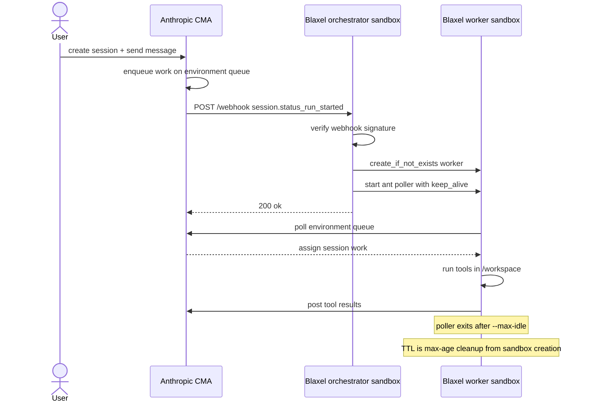

# Run Claude Managed Agent tools with Blaxel Sandboxes

Claude Managed Agents (CMA) gives you an agent loop hosted by Anthropic: the model, session state, event history, skills, and tool-calling harness. A self-hosted CMA environment keeps that orchestration on Anthropic's side but moves tool execution into infrastructure you control.

This guide shows the Blaxel version of that self-hosted path: Anthropic runs the agent loop and work queue; Blaxel sandboxes run the webhook control plane and the per-session worker runtime.

## What CMA is

CMA separates an agent into three pieces:

| Piece | In this cookbook |
| --- | --- |
| Agent loop | Anthropic runs Claude, session state, event history, skills, and tool selection. |
| Environment queue | Anthropic enqueues session work for a self-hosted environment. |
| Tool execution | Blaxel worker sandboxes run bash, file tools, skill downloads, and code. |

The model and event history remain on Anthropic's side. The filesystem, code runtime, process execution, and network boundary for tools live in the Blaxel worker sandbox.

## What Blaxel adds

Blaxel gives the self-hosted execution layer two sandbox roles:

- **Control plane:** an orchestrator sandbox runs a FastAPI webhook on a public preview URL. It receives `session.status_run_started`, verifies the webhook signature, starts a worker, and returns.
- **Compute plane:** a worker sandbox runs `ant beta:worker poll`. It claims work from Anthropic's environment queue, runs the built-in CMA tools in `/workspace`, posts results back, and exits after queue idle.

That split keeps the webhook small and lets each session run in its own sandboxed runtime.

## How the self-hosted flow works

```text
User creates a session
        |
        v
Anthropic enqueues work on the self-hosted environment
        |
        v
Anthropic sends session.status_run_started to the Blaxel preview URL
        |
        v
Orchestrator sandbox verifies whsec_ and starts one worker per session
        |
        v
Worker sandbox runs ant beta:worker poll --workdir /workspace
        |
        v
Worker claims work, runs tools, posts results, and exits after --max-idle
```



The orchestrator does not poll the queue, claim work, or supervise the session. The worker does that by running Anthropic's worker CLI.

## Security and credential boundaries

| Credential | Where it should live | Why |
| --- | --- | --- |
| `ANTHROPIC_API_KEY` | local shell only | Creates environments, agents, sessions, and reads events. Never put it on the worker. |
| `ANTHROPIC_ENVIRONMENT_KEY` | orchestrator and worker | Scoped, revocable key used by the worker to poll the environment queue. |
| `ANTHROPIC_WEBHOOK_SIGNING_KEY` | orchestrator | Verifies inbound webhook deliveries from Anthropic. |
| `BL_API_KEY` | local shell and orchestrator | Service-account key that lets the orchestrator create worker sandboxes. |

Important boundaries:

- Agent-run shell commands can read worker environment variables. Do not put broad cloud credentials, customer credentials, or the org `ANTHROPIC_API_KEY` on the worker.
- CMA file tools are scoped to `/workspace` in this cookbook and require relative paths such as `hello.txt`. Bash is still a shell inside the worker container and is not the same containment boundary.
- Tool inputs and outputs still flow through Anthropic's control plane so Claude can decide what to do next.
- This cookbook demonstrates self-hosted compute isolation and work-queue scoping. It does not implement brokered secret injection.

## Run it locally without a webhook

The fastest proof is the worker-only path. It uses real Anthropic sessions and real Blaxel sandboxes, but it skips webhook registration so you can validate the runtime first.

1. Install local deps and load env:

```bash
python3 -m pip install -r requirements-dev.txt
set -a; source .env; set +a
```

2. Check the local setup:

```bash
python3 scripts/preflight.py
```

3. Create the self-hosted environment:

```bash
python3 scripts/create_environment.py
```

Save the printed `ANTHROPIC_ENVIRONMENT_ID`, then generate `ANTHROPIC_ENVIRONMENT_KEY` in the Anthropic Console under **Manage > Environments**.

4. Build the worker:

```bash
( cd worker && bl push --workspace "$BL_WORKSPACE" --type sandbox )
```

5. Create the agent:

```bash
python3 scripts/create_agent.py
```

6. Run the local-worker session:

```bash
python3 example/run_session.py --local-worker
```

Success looks like:

```text
session: sesn_...
message sent
[local-worker] cma-worker-... is polling the queue as ant-poll-...
  tool: write {"content": "hello from blaxel", "file_path": "hello.txt"}
  tool: bash {"command": "cat /workspace/hello.txt && echo"}

final agent message: ... hello from blaxel ...
```

This proves the agent session, environment key, worker image, Blaxel sandbox creation, `ant` poller, file tools, bash tool, and result posting all work before the webhook is involved.

## Run it through the webhook

After the worker path works, add the webhook automation.

1. Build the orchestrator image:

```bash
( cd orchestrator && bl push --workspace "$BL_WORKSPACE" --type sandbox )
```

2. Create or update the orchestrator sandbox:

```bash
python3 setup.py
```

Setup starts `uvicorn` in the orchestrator sandbox and prints:

```text
=== Register this as the Anthropic webhook URL ===
  https://<id>.preview.bl.run/webhook
```

3. In the Anthropic Console, create a webhook for `session.status_run_started` pointing to that URL. Copy the one-time `whsec_...` signing secret.

4. Add the signing secret to `.env`, reload env, and rerun setup:

```text
ANTHROPIC_WEBHOOK_SIGNING_KEY=whsec_...
```

```bash
set -a; source .env; set +a
python3 setup.py
```

The rerun keeps the same preview URL and restarts the webhook server with the current signing key.

5. Run a full session:

```bash
python3 example/run_session.py
```

Success is the same transcript shape as the local-worker run. The difference is that Anthropic now triggers the orchestrator, and the orchestrator starts the worker.

## Observe and debug it

Use these checkpoints when a session stalls:

| Layer | Healthy signal | What to inspect |
| --- | --- | --- |
| Anthropic session | `example/run_session.py` prints growing event counts and a final agent message | Session id, session events, queue stats printed by the script |
| Webhook | Anthropic delivery gets HTTP 200 | `ANTHROPIC_WEBHOOK_SIGNING_KEY`, `/webhook` URL, orchestrator `/health` |
| Orchestrator | `setup.py` prints the preview URL and `signing key: configured` | Webhook server process name, orchestrator process logs |
| Worker | `ant-poll-*` process starts and tool events appear | Worker sandbox name `cma-worker-*`, process logs, image contents |
| Runtime | File and bash tools produce non-empty results | `/workspace`, `/mnt/session/outputs`, command stdout |

Common failures:

| Symptom | Fix |
| --- | --- |
| Webhook returns 503 | Add `ANTHROPIC_WEBHOOK_SIGNING_KEY` to `.env`, reload env, and rerun `python3 setup.py`. |
| Webhook returns 401 | Use the `whsec_...` value from the Anthropic Console and keep `anthropic[webhooks]` in the orchestrator image. |
| Worker freezes | Start the poller with `keep_alive: True`; outbound polling alone does not hold the sandbox active. |
| File tool rejects a path | Use `hello.txt`, not `/workspace/hello.txt`. |
| Shell result is empty | Append output such as `&& echo ok`. |
| Later turn does not start | Keep unique poller process names and the restart cooldown. Process records persist after completion. |

## Why Blaxel Sandboxes

Blaxel is a strong fit for self-hosted CMA execution when you want:

- A batteries-included worker image by default, with a Dockerfile you can customize or slim for your stack.
- One sandbox per session, named from the Anthropic session id and isolated from other sessions.
- Public preview URLs for webhook receivers and for apps the agent creates during a session.
- Process APIs and logs for seeing exactly what ran inside the sandbox.
- Standby/resume behavior for long-lived orchestrators that should not burn compute while idle.
- SDK and CLI control for building, pushing, creating, inspecting, and deleting sandboxes.

The key difference from implementing a full custom runner is that the worker uses `ant beta:worker poll`. Anthropic's worker handles queue claiming and the built-in agent toolset; the Blaxel side supplies the runtime, lifecycle, and sandbox boundary.

The included worker image is cloud-sandbox-compatible, not Anthropic-managed. It installs the language runtimes, package managers, database clients, and utilities from Anthropic's cloud sandbox reference and smokes the documented version floors, while still being a Dockerfile you own and can slim or pin for your stack.

## Operational gotchas

- The worker image is the agent runtime. Add, remove, or pin runtime dependencies in `worker/Dockerfile`.
- The final image is Debian/glibc on linux/amd64. It is compatible with the documented cloud sandbox tool surface, not byte-identical to Anthropic's Ubuntu 22.04 cloud image.
- `/bin/bash`, `tar`, and `unzip` are required by the agent toolset and skill downloads.
- The worker uses `--workdir /workspace` and does not use `--unrestricted-paths`.
- `--max-idle` controls when the poller exits after the queue is quiet. Keep it long enough to span normal model thinking between tool calls.
- `BLAXEL_WORKER_TTL` is max age from sandbox creation. It is a cleanup backstop, not idle deletion, and should be longer than expected sessions.
- Duplicate webhook suppression is in-process best effort. If the orchestrator restarts, `create_if_not_exists` still prevents duplicate worker sandboxes, and Anthropic's queue should hand each item to one poller.
- Sandbox names allow lowercase alphanumerics and hyphens. Anthropic session ids are sanitized before becoming worker names.
- This sample passes a service-account `BL_API_KEY` to the orchestrator so it can create worker sandboxes.
- Nothing is auto-exported from the worker. Read files back from `/workspace` or `/mnt/session/outputs`, or expose an app through a preview URL.

## Teardown

The orchestrator sandbox and preview URL stay live until you remove them:

```bash
bl delete sandbox cma-orchestrator-app --workspace "$BL_WORKSPACE"
```

Worker sandboxes have a TTL max age. If a test worker is still present after a failed run, delete the matching `cma-worker-*` sandbox after the session is no longer active.

Also clean up external state when you are done testing:

- Remove or disable the Anthropic webhook.
- Revoke the environment key if it was only for the test.
- Delete old Anthropic environments or agents if you created throwaway ones.

## Links

- [Anthropic self-hosted sandboxes](https://platform.claude.com/docs/en/managed-agents/self-hosted-sandboxes)
- [Anthropic Managed Agents overview](https://platform.claude.com/docs/en/managed-agents/overview)
- [Blaxel docs](https://docs.blaxel.ai)
