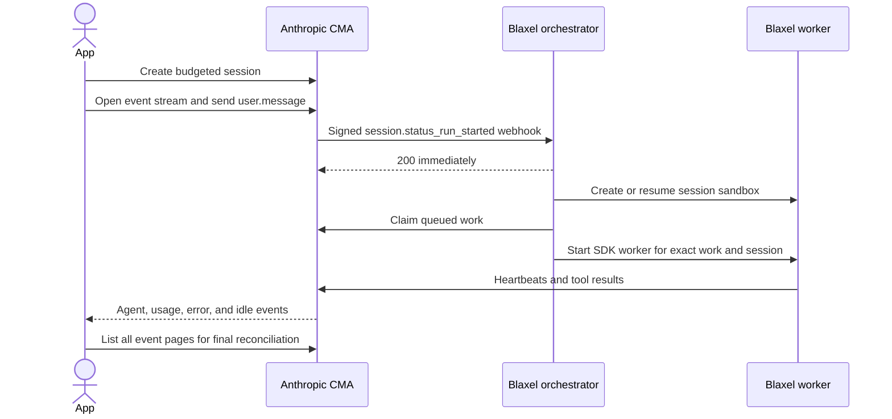

# Production guide: Claude Managed Agents on Blaxel

Use [README.md](README.md) for the shortest runnable path. This guide explains the design, security model, production controls, and advanced features.

## System boundary

| Owner | Responsibilities |
| --- | --- |
| Anthropic | Claude, agent configuration, session state, event history, skills, advisor threads, budgets, and the self-hosted work queue |
| Blaxel orchestrator | Webhook verification, worker readiness, exact work claim, recovery dispatch, and process start |
| Blaxel worker | `/workspace`, SDK tool execution, memory synchronization, work heartbeat, result delivery, previews, and optional Volume or Proxy controls |
| Your application | Session creation, user events, streamed output, receipts, input staging, and lifecycle policy |

The orchestrator never runs agent tools. It creates or resumes the per-session worker, then starts the SDK `EnvironmentWorker` for the exact `work_*` and `sesn_*` pair.

## Request lifecycle


```mermaid
sequenceDiagram
    actor App
    participant CMA as Anthropic CMA
    participant O as Blaxel orchestrator
    participant W as Blaxel worker

    App->>CMA: Create budgeted session
    App->>CMA: Open event stream and send user.message
    CMA->>O: Signed session.status_run_started webhook
    O-->>CMA: 200 immediately
    O->>W: Create or resume session sandbox
    O->>CMA: Claim queued work
    O->>W: Start SDK worker for exact work and session
    W->>CMA: Heartbeats and tool results
    CMA-->>App: Agent, usage, error, and idle events
    App->>CMA: List all event pages for final reconciliation
```

The event stream is the responsive path. The complete paginated event list is the authoritative final record and reconnect path. `session.error` is a failure even when earlier HTTP requests succeeded.

## Configuration

### Required local values

| Variable | Purpose |
| --- | --- |
| `ANTHROPIC_API_KEY` | Control-plane access for environments, agents, sessions, and events |
| `BL_WORKSPACE` | Exact Blaxel workspace |
| `BL_API_KEY` | Service-account access for sandbox operations |
| `ANTHROPIC_ENVIRONMENT_ID` | Self-hosted environment created by the setup script |
| `ANTHROPIC_ENVIRONMENT_KEY` | Scoped work-queue and worker credential |
| `ANTHROPIC_AGENT_ID` | Versioned agent configuration used by examples |
| `ANTHROPIC_AGENT_VERSION` | Exact agent version used by the AG-UI adapter |
| `ANTHROPIC_WEBHOOK_SIGNING_KEY` | Webhook verification secret |

`bl push` uses the CLI login. `BL_API_KEY` does not replace `bl login`.

### Agent defaults

The default agent uses `claude-sonnet-5` and the built-in `agent_toolset_20260401`. Sonnet 5 uses adaptive thinking by default. Do not add manual thinking budgets or non-default sampling values.

Optional agent creation settings:

```bash
export ANTHROPIC_AGENT_MODEL=claude-sonnet-5
export ANTHROPIC_INFERENCE_GEO=us
export ANTHROPIC_ADVISOR_MODEL=claude-opus-5
export ANTHROPIC_AGENT_SKILLS=xlsx,skill_01Example@latest
python3 scripts/create_agent.py
```

Changing these values creates a new agent. Save the printed ID and version before you start sessions.

### Skills and external inputs

Managed Agent skills are agent configuration. The worker downloads them into its work directory. Use Anthropic skill names such as `xlsx`, or custom workspace IDs such as `skill_*`.

Self-hosted sessions accept `memory_store` resources at creation time. The SDK worker materializes them under `/mnt/memory/` and synchronizes changes. Self-hosted sessions do not mount uploaded files or GitHub repositories automatically. For those inputs:

- Put reusable instructions in a Managed Agent custom skill.
- Put an object URL or commit SHA in session metadata.
- Retrieve the session metadata after work claim, then stage files before tool execution.
- Bake trusted, static project material into a purpose-built worker image.

Treat staged code and skills as executable input. Pin revisions and use least-privilege credentials.

## Sessions and costs

The examples create a budget before the first turn. Anthropic does not let you add a budget later to an unbudgeted session.

The default is 100 US cents. The session pauses with `budget_reached` when the tracked list cost reaches the ceiling. Enforcement happens between model requests, so the request that crosses the ceiling finishes.

Each successful example prints:

- Resolved model ID.
- Input and output tokens.
- List cost in US cents.
- Runtime-priced active seconds.
- Total duration.

Use `--resume-budget-cents` to raise the same ceiling once. Use `--no-budget` only for a deliberate exception.

## Dispatch reliability

The webhook is a fast path. The orchestrator also runs a recovery loop.

| Control | Default | Purpose |
| --- | --- | --- |
| `ANT_DISPATCHER_DEBOUNCE_MS` | `250` | Collect near-simultaneous starts before claim |
| `ANT_DISPATCHER_ATTEMPTS` | `3` | Retry transient claim failures |
| `ANT_DISPATCHER_RECOVERY_SECONDS` | `15` | Recover delayed or missed webhook work |
| `ANT_MAX_CONCURRENT_WORKER_STARTS` | `8` | Bound worker cold-start fan-out |
| `BLAXEL_WORKER_READY_ATTEMPTS` | `45` | Bound sandbox readiness checks |
| `ANT_RUN_START_ATTEMPTS` | `10` | Bound process start attempts after claim |
| `ANT_DISPATCHER_RECLAIM_MS` | `30000` | Reclaim acknowledged but unhandled work |

The webhook and recovery path share one dispatcher lock. Work claims are durable. In-process sets only suppress duplicate starts during the local handoff.

Use one Anthropic environment per Blaxel workspace. Any claimant for a shared environment can run work with its own Blaxel credentials.

## Worker profiles

### Quickstart

Use quickstart for Python, Node.js, shell, Git, and common build tasks. It is the default Docker target and Blaxel build profile.

### Full

Use full when tasks need Go, Rust, Java, Ruby, PHP, database clients, or Docker tooling.

```bash
cd worker
bl push --workspace "$BL_WORKSPACE" --type sandbox \
  --name cma-worker-full \
  --build-env-file full.build.env
```

Set `BLAXEL_WORKER_IMAGE=sandbox/cma-worker-full:latest` before you start or update the orchestrator.

Both profiles contain `sandbox-api`, the hash-locked Anthropic SDK worker, `/workspace`, and `/mnt/memory`. Both run `worker/smoke.sh` in CI.

## Blaxel features

### Process proof

Transcript success proves the session. It does not prove which worker handled it. Require the matching sandbox and process:

```bash
bl get sandbox cma-worker-sesn-... process \
  --workspace "$BL_WORKSPACE" -o json

bl logs sandbox cma-worker-sesn-... cma-run-... \
  --workspace "$BL_WORKSPACE" --period 1h
```

### Private previews

The preview demo creates a token-protected preview by default. It checks that access without the token fails. It also checks that the same server process remains after standby and resume.

Public preview is explicit:

```bash
python3 example/demo_preview_resume.py --public-preview
```

### Per-session Volume

Enable a Volume only when project state must survive worker deletion or recreation:

```bash
export BL_REGION=us-pdx-1
export BLAXEL_WORKER_VOLUME_ENABLED=true
export BLAXEL_WORKER_VOLUME_SIZE_MB=2048
export BLAXEL_WORKER_VOLUME_MOUNT=/workspace
```

One Volume belongs to one session worker. Delete the sandbox first. Then delete the Volume and wait for confirmed absence.

### Proxy secret injection

Use Blaxel Proxy for third-party request credentials when the worker region supports it:

```bash
export BL_REGION=us-pdx-1
export BLAXEL_WORKER_PROXY_DESTINATIONS=api.example.com
export BLAXEL_WORKER_PROXY_HEADER_NAME=Authorization
export BLAXEL_WORKER_PROXY_HEADER_VALUE='Bearer {{SECRET:api-token}}'
export BLAXEL_WORKER_PROXY_SECRET_NAME=api-token
export BLAXEL_WORKER_PROXY_SECRET_VALUE=...
```

The orchestrator uses the secret to configure the sandbox network. It does not pass the secret into the worker process environment.

## Security boundaries

- Keep `ANTHROPIC_API_KEY` local. Never send it to the orchestrator or worker.
- The worker receives the environment key as a required fallback and prefers the session-scoped token carried by `ANTHROPIC_WORK_SECRET`. The SDK scrubs both from agent-run bash environments.
- Keep the SDK worker's default restricted-path mode. This limits file tools to `/workspace`.
- The path limit is not a shell sandbox. Bash can access other paths inside the container.
- Keep preview apps private unless public access is required.
- Verify the webhook signature before reading its event.
- Use an allowlist for every orchestrator environment variable.
- Use Proxy injection for third-party secrets when possible.
- Review and pin custom skills.
- Set session budgets and local timeouts.

## Health and operations

`GET /health` reports process liveness. `GET /ready` reports configuration readiness, worker image, recovery interval, and the last recovery result. Setup checks both endpoints when the signing key exists.

Use the operations CLI for a current view:

```bash
python3 cookbook.py status
```

Its output includes queue depth, pending claims, active pollers, resolved agent configuration, default-model drift warnings, recent cookbook receipts, worker sandboxes, and Volumes.

Cleanup requires an exact session:

```bash
python3 cookbook.py cleanup --session sesn_...
python3 cookbook.py cleanup --session sesn_... --apply
```

The default action archives the Anthropic session. Use `--session-action delete` only when history must be removed. Use `--interrupt` only when you intend to stop a running session.

## Failure handling

| Signal | Meaning | Action |
| --- | --- | --- |
| `session.error` | Execution failed | Read the error type and retry status; fail the run |
| `budget_reached` | Hard list-cost ceiling reached | Stop or raise the existing ceiling |
| `requires_action` | A tool needs an external result or confirmation | Handle the event explicitly |
| `retries_exhausted` | Managed retry policy ended | Inspect session errors and spans |
| Stream disconnect | Live connection failed | Reconnect and list full event history |
| No event progress | Worker stalled or froze | Interrupt and inspect `cma-run-*` logs |
| Transcript pass without worker | Another claimant ran it | Use a quiet environment and direct dispatch |
| `/ready` returns 503 | Signing or dispatcher config is incomplete | Fix the listed problem, then rerun setup |

## Verification ladder

Run local tests before any live resource change:

```bash
.venv/bin/python -m pip check
.venv/bin/python -B -m compileall -q \
  bootstrap.py cookbook.py setup.py orchestrator example scripts
.venv/bin/python -m pytest -q
```

Build and smoke both worker profiles:

```bash
docker build --platform linux/amd64 \
  --build-arg WORKER_PROFILE=quickstart \
  -t cma-worker:quickstart worker
docker run --platform linux/amd64 --rm \
  --entrypoint /worker/smoke.sh cma-worker:quickstart

docker build --platform linux/amd64 \
  --build-arg WORKER_PROFILE=full \
  -t cma-worker:full worker
docker run --platform linux/amd64 --rm \
  --entrypoint /worker/smoke.sh cma-worker:full
```

Then run live checks in this order:

1. Direct-dispatch hello proof.
2. Webhook hello proof.
3. Only the optional feature your deployment needs.
4. `cookbook.py status` receipt.
5. Exact cleanup plan.

## Teardown

Per-session cleanup is automated. Broader teardown remains explicit because it affects shared resources.

- Archive or delete test sessions.
- Delete each exact worker. Wait for absence.
- Delete its Volume after the worker. Wait for absence.
- Remove the Anthropic webhook before deleting its Blaxel orchestrator.
- Delete the orchestrator only when no session depends on it.
- Revoke throwaway environment keys.
- Delete throwaway agents and environments only after you confirm they are not shared.
- Keep published images for reuse unless registry removal is intentional.

## Primary references

- [Start a Managed Agents session](https://platform.claude.com/docs/en/managed-agents/sessions)
- [Events and streaming](https://platform.claude.com/docs/en/managed-agents/events-and-streaming)
- [Self-hosted sandboxes](https://platform.claude.com/docs/en/managed-agents/self-hosted-sandboxes)
- [Managed Agent skills](https://platform.claude.com/docs/en/managed-agents/skills)
- [Multiagent orchestration](https://platform.claude.com/docs/en/managed-agents/multiagent-orchestration)
- [Claude Sonnet 5](https://platform.claude.com/docs/en/about-claude/models/whats-new-sonnet-5)
- [Blaxel documentation](https://docs.blaxel.ai)
