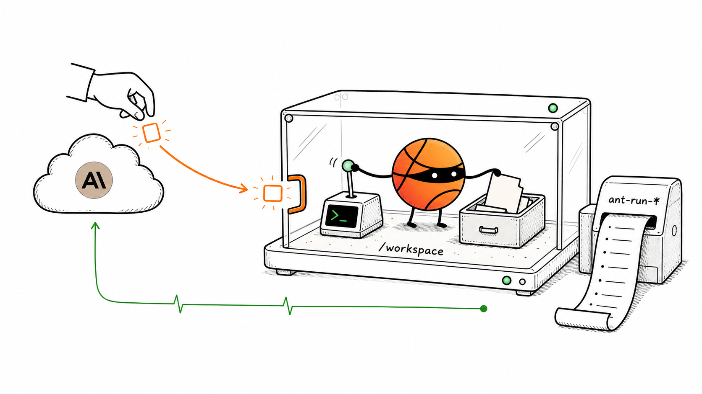
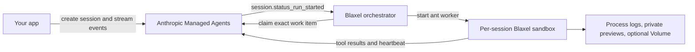

# Claude Managed Agents on Blaxel

<p align="center">
  
</p>

<p align="center"><a href="assets/cma-blaxel-sandbox-15s-uhd.mp4">Watch the 4K MP4</a> · silent 15-second explainer</p>

Claude Managed Agents (CMA) lets you define a reusable agent, equip it with tools and session state, start work from application events, and run each session in an isolated Blaxel sandbox with a concrete result and traceable lifecycle.

Run Anthropic's hosted agent loop with tool execution in isolated Blaxel sandboxes. This cookbook gives you a verified worker, a webhook orchestrator, safe cost controls, live event output, and exact cleanup.



## What you get

| Default | Value |
| --- | --- |
| Model | `claude-sonnet-5` |
| Session budget | Hard `$1.00` list-cost ceiling |
| Worker | One Blaxel sandbox per session |
| Events | SDK stream with paginated history recovery |
| Preview access | Private token by default |
| Cleanup | Exact plan first, `--apply` required |

The first proof makes Claude write a file, reads it through bash, validates the final marker, and prints the exact Blaxel process that ran it.

```text
session: sesn_...
  running
  tool write: {"file_path": "hello.txt", ...}
  tool bash: {"command": "cat /workspace/hello.txt"}
  idle: end_turn

EXAMPLE: PASS

Usage receipt:
  "model": "claude-sonnet-5"
  "list_cost_cents": "..."

Blaxel process proof:
  sandbox: cma-worker-sesn-...
  process: ant-run-...
```

## Architecture



Anthropic owns Claude, session state, event history, and the self-hosted work queue. Blaxel owns the worker filesystem, process execution, network controls, and runtime proof.

## Start here

You need Claude Managed Agents access, a Blaxel workspace, Docker, Python 3, and the `bl` CLI logged in with `bl login`.

```bash
python3 -m venv .venv
source .venv/bin/activate
python -m pip install --require-hashes -r requirements-dev.lock
cp .env.example .env
```

Set these three values in `.env`:

```bash
export ANTHROPIC_API_KEY=sk-ant-api03-...
export BL_WORKSPACE=your-workspace
export BL_API_KEY=your-service-account-key
```

Inspect the next action without creating anything:

```bash
python3 bootstrap.py --plan
```

Run the guided setup when you are ready to create and publish resources:

```bash
python3 bootstrap.py
```

Bootstrap stops at two Console steps that require you:

1. Generate the scoped environment key in the Anthropic Console.
2. Register the printed webhook URL for `session.status_run_started`.

It resumes from `.env` after each step. It does not report success unless the final webhook proof passes.

### Upgrade an existing setup to Sonnet 5

The default applies when you create a new agent. Managed Agent configurations are versioned, so an existing agent keeps its original model.

```bash
set -a; source .env; set +a
python3 scripts/create_agent.py
# Replace ANTHROPIC_AGENT_ID in .env with the printed value.
python3 cookbook.py status
```

The status output warns when the configured agent does not use `claude-sonnet-5`. It does not delete the old agent.

## Prove each layer

Prove the worker before you add a webhook:

```bash
set -a; source .env; set +a
python3 example/run_session.py --direct-dispatch
```

Then prove the full webhook path:

```bash
python3 example/run_session.py
```

A valid run has all three results:

- `EXAMPLE: PASS` from deterministic transcript checks.
- A usage receipt with model, tokens, cost, and active time.
- A matching `cma-worker-*` sandbox and `ant-run-*` process.

Use one active queue claimant per environment during proof. Another dispatcher can claim the work and make transcript-only attribution invalid.

## Try the useful examples

### Sonnet 5 with an Opus 5 advisor

Create an agent with the optional advisor, then prove that a real advisor thread ran:

```bash
export ANTHROPIC_ADVISOR_MODEL=claude-opus-5
python3 scripts/create_agent.py
# Save the printed ANTHROPIC_AGENT_ID, then reload .env.
python3 example/run_session.py --direct-dispatch --scenario advisor
```

### Agent Skills

Attach Anthropic or custom workspace skills when you create the agent. Use short names for Anthropic skills and `skill_*` IDs for custom skills.

```bash
export ANTHROPIC_AGENT_SKILLS=xlsx,skill_01Example@latest
python3 scripts/create_agent.py
# Save the new agent id, then use the skill's real name or purpose.
python3 example/run_session.py --direct-dispatch --scenario skill --skill-name xlsx
```

Self-hosted sessions do not accept session `resources`. Configure skills on the agent. Use session metadata plus your own staging logic for repository or object-store inputs.

### Agent-authored app with private preview and resume

```bash
python3 example/demo_preview_resume.py
```

This example fails if the agent does not author valid code. It creates no harness fallback. It also proves private access, the supervised process, and the same process after sandbox standby and resume.

Use `--public-preview` only when the app can be public.

### Long session and file-tool containment

```bash
python3 example/validate_long_session.py
```

This runs more than 90 seconds of tool work. It fails on an event stall. It also requires the exact write outside `/workspace` to return a tool error.

## Cost controls

Every example session starts with a hard 100-cent ceiling. The API enforces the ceiling between model requests, so the last request can finish slightly above it.

```bash
# Raise the same session once if it reaches the first ceiling.
python3 example/run_session.py --direct-dispatch \
  --budget-cents 100 \
  --resume-budget-cents 200

# Deliberate opt-out.
python3 example/run_session.py --direct-dispatch --no-budget
```

The scripts fail on `session.error`, `requires_action`, `retries_exhausted`, timeout, or a failed verification check.

## Worker profiles

The default quickstart image includes Python 3.12, Node.js 22, Git, shell tools, and common build utilities.

```bash
cd worker
bl push --workspace "$BL_WORKSPACE" --type sandbox
```

The full profile adds Go, Rust, Java, Gradle, Maven, Ruby, PHP, database clients, and Docker tooling.

```bash
cd worker
bl push --workspace "$BL_WORKSPACE" --type sandbox \
  --name cma-worker-full \
  --build-env-file full.build.env
export BLAXEL_WORKER_IMAGE=sandbox/cma-worker-full:latest
```

Both profiles have separate container smoke tests in CI.

## Operate it

Read current queue, agent, model-drift warnings, recent cookbook sessions, workers, and Volumes:

```bash
python3 cookbook.py status
```

Preview exact per-session cleanup:

```bash
python3 cookbook.py cleanup --session sesn_...
```

Apply that exact plan:

```bash
python3 cookbook.py cleanup --session sesn_... --apply
```

Cleanup archives the session by default. It deletes the exact worker and optional Volume, then waits until each resource is absent. It retains the environment, agent, images, webhook, and orchestrator.

## Production guardrails

- The webhook verifies Anthropic signatures and returns quickly.
- A recovery loop claims queued work after delayed webhooks or sandbox resume.
- Worker starts use bounded concurrency and bounded retries.
- `/health` is liveness. `/ready` checks webhook and dispatcher configuration.
- The control-plane API key never enters a worker.
- Proxy secret injection keeps third-party secrets out of worker environment variables.
- A Volume is optional and session-scoped. Delete the worker before its Volume.
- Requirements have minimum files for upgrades and hashed lock files for repeatable installs.

Read [GUIDE.md](GUIDE.md) for security boundaries, optional Blaxel features, operations, and troubleshooting. Read [.env.example](.env.example) for every setting.

## Verify locally

```bash
.venv/bin/python -m pip check
.venv/bin/python -B -m compileall -q \
  bootstrap.py cookbook.py setup.py orchestrator example scripts
.venv/bin/python -m pytest -q

docker build --platform linux/amd64 \
  --build-arg WORKER_PROFILE=quickstart \
  -t cma-worker:quickstart worker
docker run --platform linux/amd64 --rm \
  --entrypoint /worker/smoke.sh cma-worker:quickstart
```

## Current upstream contract

This cookbook targets:

- Anthropic Managed Agents beta header `managed-agents-2026-04-01`.
- Anthropic Python SDK `0.121.0`.
- Anthropic CLI `1.22.1`.
- Blaxel Python SDK `0.4.1`.
- Claude Sonnet 5 model ID `claude-sonnet-5`.

Primary references: [Managed Agents sessions](https://platform.claude.com/docs/en/managed-agents/sessions), [events and streaming](https://platform.claude.com/docs/en/managed-agents/events-and-streaming), [self-hosted sandboxes](https://platform.claude.com/docs/en/managed-agents/self-hosted-sandboxes), [Agent Skills](https://platform.claude.com/docs/en/managed-agents/skills), [multiagent orchestration](https://platform.claude.com/docs/en/managed-agents/multiagent-orchestration), and [Claude Sonnet 5](https://platform.claude.com/docs/en/about-claude/models/whats-new-sonnet-5).
